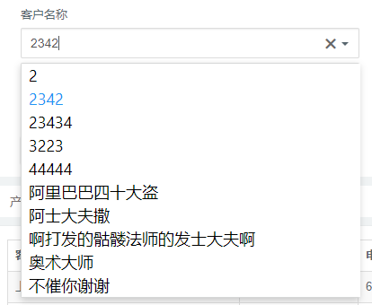
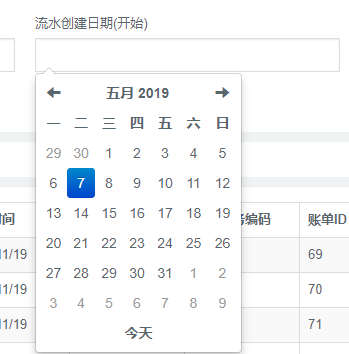
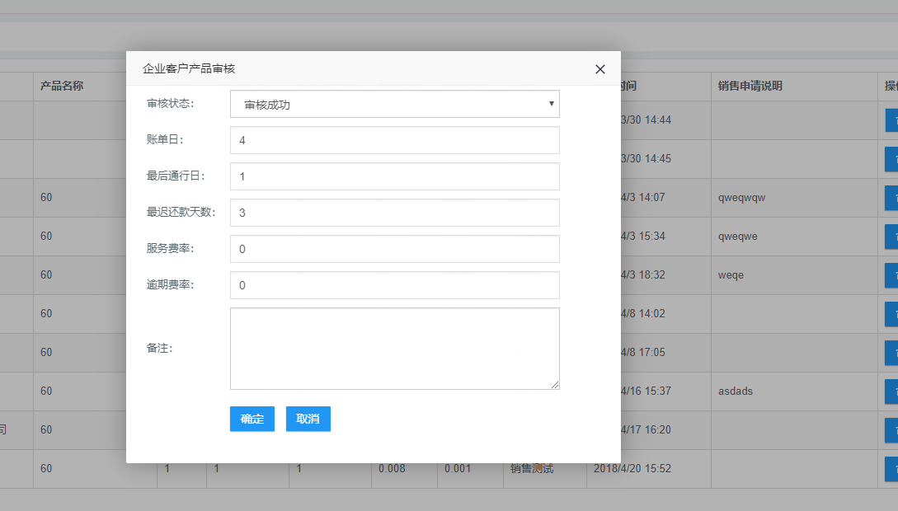
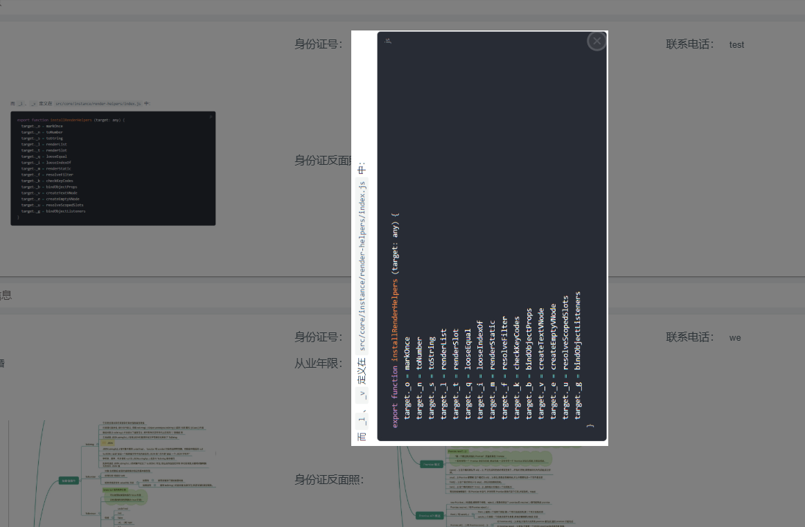
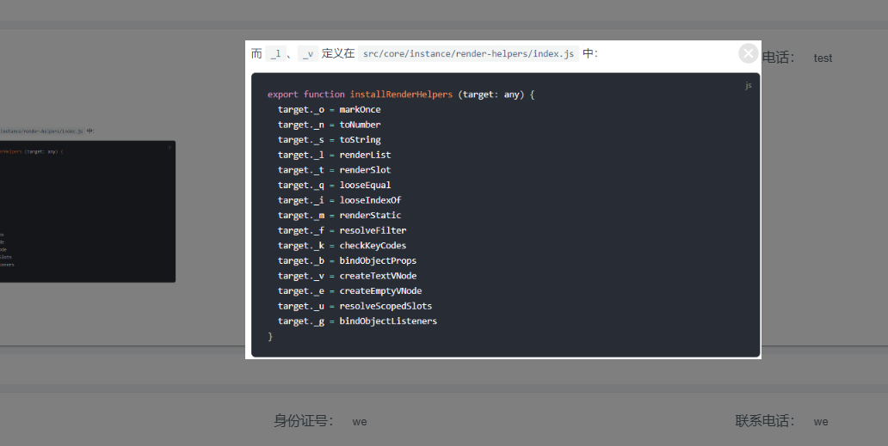

# js常用代码片段

## 下拉框
#### 输入框通过接口数据变成下拉框  `selectpage.js`的[使用文档](https://terryz.github.io/selectpage/)



使用的js、css文件
```html
<link href="~/Content/asset/js/plugins/自动完成下拉选择--支持中文/css/selectpage.css" rel="stylesheet" />
<script src="~/Content/asset/js/plugins/自动完成下拉选择--支持中文/js/selectpage.js"></script>
```
相关js代码
```javascript
$.ajax({
            url: '/FinancialManage/CustomerBillManage/GetBCustomer', //后端接口
            datatype: 'json',
            type: "post",
            success: function (data) {
                $('#CustomerName').selectPage({
                    showField: 'Name', //显示的后端字段
                    keyField: 'ID', //作为key的后端字段
                    pagination: false, ///关闭分页栏，数据将会一次性在列表中展示，上限200个项目
                    data: data
                });
            }
        });
```


下拉框初始化之后 设置选中某一项
```js
$('#ParentAgentName_form').val(value.ParentID);
$('#ParentAgentName_form').selectPageRefresh(); //设置val后需要刷新列表
```

清空下拉框
```js
$('#ParentAgentName_form').selectPageClear();
```
禁用下拉框
```js
$('#ParentAgentName_form').selectPageDisabled(true);
```
解除禁用下拉框
```js
$('#ParentAgentName_form').selectPageDisabled(false);
```

#### 原生select下拉框禁用选择
```js
$("select").prop("disabled", true);
```

## 日历选择
输入框通过接js插件变成日历选择



使用的js文件与html
```html
<script src="~/Content/datetimepicker/datetimepicker.js"></script>

<input type="text" id="ConsumeDetailDateStart" class="form-control ChoiceTime" autocomplete="off"/>
```
相关js代码
```js
$('.ChoiceTime').datetimepicker({
            format: 'yyyy-mm-dd',
            weekStart: 1,
            todayBtn: 1,
            autoclose: true,
            todayHighlight: 1,
            startView: 2,
            minView: 2,
            forceParse: 0,
        });
```

## 翻页列表


> 使用的js文件与html
```html
<script src="~/Content/asset/js/cmn/Cmn.js"></script>
<script src="~/Content/asset/js/cmn/CmnAjax.js"></script>
<script src="~/Content/asset/js/cmn/CmnFuncExd.js"></script>

<tbody>
    <tr class="Js_tableDataList">
        <td>{AgentName}</td>
        <td>{CustomerName}</td>
        <td>{ProductName}</td>
        <td style="text-align:right;padding-right:20px;">{ConsumeMoneys}</td>
        <td style="text-align:right;padding-right:20px;">{ServiceMoneys}</td>
        <td style="text-align:right;padding-right:20px;">{Rate}</td>
        <td>{ConsumeDate}</td>
        <td>{LastPaymentDate}</td>
        <td>{CustomerFinanceNumber}</td>
        <td>{BillID}</td>
        <td>{ConsumeDetailDate}</td>
        <td>{CreateTime}</td>
    </tr>
</tbody>
<li class="list_page_box">
    <div class="" style="position:absolute;left:0px;top:20px;">
        <select style="width:100px;padding:5px;margin-right:10px;" id="exchangePageSize">
            <option value="10">每页10条</option>
            <option value="20">每页20条</option>
            <option value="30">每页30条</option>
            <option value="40">每页40条</option>
            <option value="50">每页50条</option>
        </select>
        共<a href="javascript:void(0)" class="pagCount" style="margin-left:5px;"></a>页，
        <a href="javascript:void(0)" class="js_RecCount" style="margin-left:5px;"></a>条
    </div>
    <a href="javascript:void(0)" class="pagFirst">首页</a>
    <a href="javascript:void(0)" class="pagPre"><span aria-hidden="true">&laquo;</span></a>
    <a href="javascript:void(0)" class="pagNum active">1</a>
    <a href="javascript:void(0)" class="pagNext"><span aria-hidden="true">&raquo;</span></a>
    <a href="javascript:void(0)" class="pagLast"><span aria-hidden="true">尾页</span></a>
</li>
```

> 相关js代码
```js
 //消息翻页
    function DataPagingTableDataList(params, exchangePageSize, PageIndex) {
        _dataPaging = new CmnAjax.DataPaging(".Js_tableDataList", "/ConsumeDaySum/LoadData", params, ".list_page_box", exchangePageSize, function (data) {//成功时调用的函数
            $('.js_RecCount').html(data.RecCount)
            window.parent.postMessage("dataLoadSuccess", '*');
        }, function (data) {
            //填充数据之前特殊处理数据
            $.each(data.data, function (i, item) {
               if (item.Borrow == 0) {
                   item.Borrows = "-";
               }
               if (item.Loan == 0) {
                   item.Loans = "-";
               }
            })
        }, null, null, PageIndex);
        _dataPaging.Paging.ActiveClass = "active";
        _dataPaging.Paging.SetCycleNextPre(true);
    }
```
> 查看方法定义看具体参数
```js
DataPaging: function (dataContainerSelector, methodName, param, pageContainerSelector, pageSize, successFunc, beforePadFun, errorFunc,
        loadingSelector, curPageNo) {
        /// <summary>填充数据带翻页控件</summary>
        /// <param name="dataContainerSelector" type="String">控件容器选择器(和jquery的选择器一样，例如：.className或#controlID(如果是多条记录的话不能用id否则在二次填充的时候会多出记录)等)</param>
        /// <param name="methodName" type="String">后台WebMethod名，也可以是全路径</param>
        /// <param name="param" type="String">调用webmethod的参数，例如：{id:'1',name:'name'}(可为空或不传)  </param>
        /// <param name="pageContainerSelector" type="String">翻页控件容器选择器(和jquery的选择器一样，例如：.className或#controlID等)</param>
        /// <param name="pageSize" type="int">每页显示的记录条数</param>
        /// <param name="successFunc" type="function">成功时调用的函数，参数为jason格式的数据例如：{"data":[{"id":"1","name":"chi"},{"id":"2","name":"chi2"}]} (可以不传)</param>
        /// <param name="errorFunc" type="function">错误时调用的函数 (可以不传)</param>
        /// <param name="loadingSelector" type="String">正在加载提示选择器(和jquery的选择器一样，例如：.className或#controlID等)</param>
        /// <param name="curPageNo" type="int">当前页为第几页</param>
        /// <field name="Paging" type="Cmn.Paging">翻页控件</field>
        。。。。
        }
```

## 弹框

使用的js文件与html


```html
 <script src="~/Content/asset/layer/layer.js"></script>
 ```
### Alert消息框
```js
var CardNum = $('#CardNum').val();
if (!CardNum) {
    layer.alert('请输入客户名称', { offset: scrollTop + 'px' });
    return;
}
```
直接看[官网](https://layer.layui.com/)吧

### confirm消息框
直接看[官网](https://layer.layui.com/)吧

```js
layer.confirm('是否确定批量写卡？', {
                    btn: ['确定', '取消'] //按钮
    }, function () {
        layer.close(layer.confirm());
        $.ajax({
            url: "/CustomerCardOpen/CardOpen",
            data: { ALLID: aa },
            success: function (result) {
                if (result == "开卡成功！") {
                    location.href = "/RiskManage/CustomerCardOpen/Index";
                }else if (result != "") {
                    layer.alert(result, { offset: top + 'px' });
                } else {
                    layer.alert('操作失败，请重试！', { offset: top + 'px' });
                }
            }
        })
    });  
```

### 内容弹框--表格、输入框等包含在输入框里的任意html内容

直接看[官网](https://layer.layui.com/)吧




## 导出功能
主要是调用后台接口，前端只是一句代码的事

```js
//字段跟查询条件的字段一模一样，直接去查询条件出拿过了
$("#outPut").click(function () {
            var CustomerName = $("#CustomerName").val();
            var CarNum = $.trim($("#CarNum").val());
            var CardNum = $.trim($("#CardNum").val());
            var ExpressCompany = $("#ExpressCompany").val();
            var WriteCardTime = $("#WriteCardTime").val();
            var WriteCardTimes = $("#WriteCardTimes").val();
            var IsWriteCard = $("#IsWriteCard").val();

            location.href = "/CustomerCardOpen/outPut?CustomerName=" + CustomerName + "&CarNum=" + CarNum + "&CardNum=" + CardNum + "&ExpressCompany=" + ExpressCompany + "&WriteCardTime=" + WriteCardTime + "&WriteCardTimes=" + WriteCardTimes + "&IsWriteCard=" + IsWriteCard;
        })
```

## 图片旋转
不是正方形的图片也可以居中旋转，并且右上角关闭按钮始终在右上角的位置
- **旋转前**



- **旋转后**



- **previewImg.js的使用**

页面中直接引用previewImg.js，给一个元素class为Js_preImg_btn，保持背景图background与自定义属性data-img有同一个图片地址

js文件引用、html相关代码
```html
<script src="~/Content/asset/layer/previewImg.js"></script>

<span class="Js_preImg_btn" style="display:inline-block;vertical-align: middle; width:300px;height:300px;background:url('/Content/images/timg.jpg') center no-repeat;background-size:contain" data-img="/Content/images/timg.jpg"></span>
```
